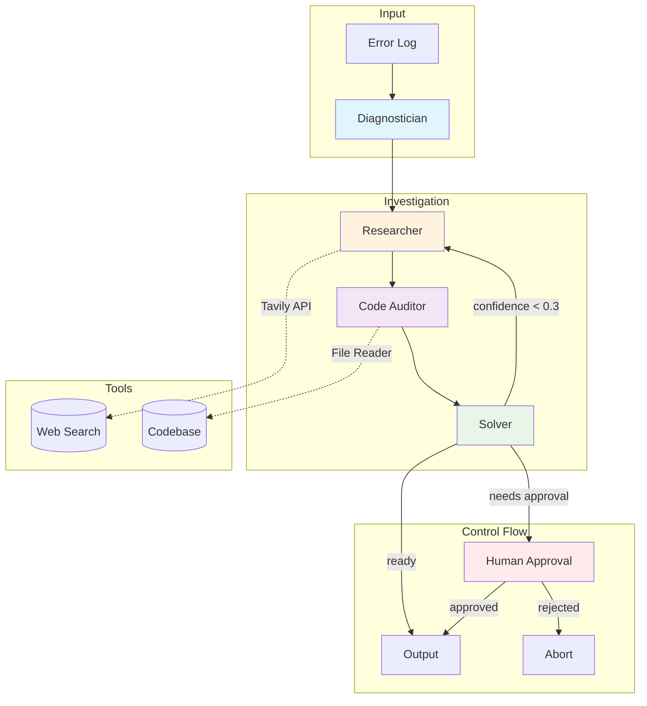
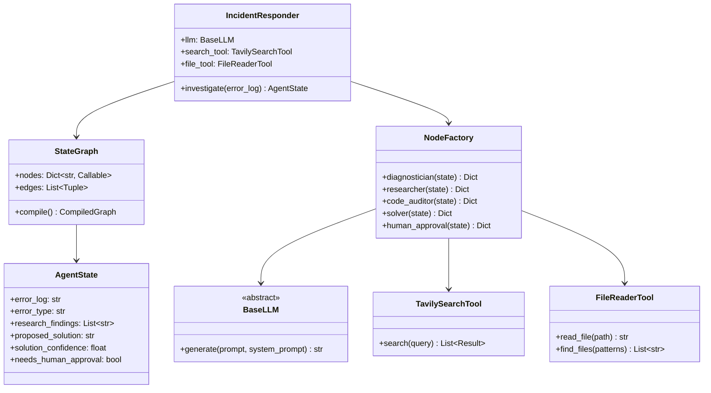

<p align="center">
  
</p>

<p align="center">
  <strong>An autonomous, graph-based AI agent that diagnoses runtime errors like a Junior SRE.</strong>
</p>

<p align="center">
  <a href="https://www.python.org/downloads/"></a>
  <a href="https://github.com/yourusername/devops-incident-responder/blob/main/LICENSE"></a>
  <a href="https://github.com/langchain-ai/langgraph"></a>
</p>

---

## The Problem

When a production error occurs at 2am, engineers face the same repetitive process: read the stack trace, search for solutions, check the code, and implement a fix. This workflow is predictable enough to automate, yet complex enough that simple scripts fail.

Traditional AI assistants treat this as a single-shot problem. You paste an error, get a response, and hope it works. But real debugging is iterative. You search, find partial answers, refine your understanding, and try again.

This project aims to introduce a **state machine architecture** for incident response. Instead of a black-box agent, you get an observable, controllable workflow where each step is explicit. The agent can loop back to gather more information when its confidence is low, and it pauses for human approval before executing anything destructive.

## Quick Start

```python
from src.graph import IncidentResponder

# Initialise the agent
responder = IncidentResponder(verbose=True)

# Feed it an error
error_log = """
psycopg2.OperationalError: could not connect to server: Connection refused
    Is the server running on host "localhost" and accepting TCP/IP connections on port 5432?
"""

# Run the investigation
result = responder.investigate(error_log)

# Get the solution
print(result["proposed_solution"])
print(result["solution_steps"])
```

Or use the CLI:

```bash
# Interactive mode with sample errors
python -m src.main

# Direct error input
python -m src.main --error "OOMKilled: Container exceeded memory limit"

# From a log file
python -m src.main --file error.log
```

## Architecture





## Key Concepts

### State Machine Architecture

Unlike black-box agents, where you pray to the Cursor God and hope the AI figures it out, this project uses **LangGraph** to define an explicit state machine. Every node is a function that reads from and writes to a typed state object. Every edge is a deliberate transition. You can trace exactly how information flows through the system.

```python
class AgentState(TypedDict):
    error_log: str              # The input
    error_type: str             # Diagnosis result
    research_findings: List[str] # What we learned
    proposed_solution: str       # The fix
    solution_confidence: float   # How sure we are (0.0 - 1.0)
    needs_human_approval: bool   # Safety flag
```

### Cyclical Graph Flows

Real debugging is iterative. If the Solver produces a low-confidence answer, the graph loops back to the Researcher with a refined query. This self-correction continues until either (1) confidence exceeds the threshold, (2) max iterations are reached, or (3) the solution is accepted.

```python
def check_solution_confidence(state: AgentState) -> str:
    if state["solution_confidence"] < 0.3:
        return "research"  # Loop back
    if state["needs_human_approval"]:
        return "human_approval"  # Checkpoint
    return "end"  # Done
```

### Human-in-the-Loop

The agent pauses before executing destructive operations. If the proposed solution involves `DROP TABLE`, `rm -rf`, or similar commands, the workflow routes to a human approval checkpoint. The engineer sees exactly what the agent wants to do and can approve or abort.

```
HUMAN APPROVAL REQUIRED
-----------------------------
The agent wants to perform:
  DROP TABLE users; -- Recreate with correct schema

Type 'yes' to approve or 'no' to abort:
```

### Tool Integration

The agent has two primary tools:

1. **TavilySearchTool**: Searches the web for StackOverflow answers, documentation, and blogposts. Tavily is optimised for AI agents and provides clean, structured results.

2. **FileReaderTool**: Safely reads files from your codebase. It has security guards to block access to `.env`, secrets, as well as other sensitive files.

### Framework Agnostic Design

The LLM interface is abstracted behind `BaseLLM`. Swap providers without changing the graph logic. The default is Google Gemini (free tier cuz I'm just a broke uni student), but the architecture supports any LLM that can follow structured prompts.

## Installation

```bash
git clone https://github.com/yourusername/devops-incident-responder.git
cd devops-incident-responder

# Create virtual environment
python -m venv venv
venv\Scripts\activate  # Windows
# source venv/bin/activate  # Linux/Mac

# Install dependencies
pip install -r requirements.txt
```

Set your environment variables:

```bash
# Required - Google Gemini (FREE)
# Get your key at: https://aistudio.google.com/app/apikey
GOOGLE_API_KEY=your_gemini_api_key

# Required - Tavily Search (FREE - 1000 searches/month)
# Get your key at: https://tavily.com
TAVILY_API_KEY=your_tavily_api_key
```

Or copy the example file:

```bash
copy .env.example .env  # Windows
# cp .env.example .env  # Linux/Mac
```

## Project Structure

```
devops-incident-responder/
├── src/
│   ├── main.py           # CLI entry point
│   ├── graph.py          # LangGraph workflow definition
│   ├── nodes.py          # Node functions (the workers)
│   ├── state.py          # AgentState TypedDict
│   ├── prompts.py        # All LLM prompts
│   ├── llm.py            # LLM interface (Gemini)
│   └── tools/
│       ├── search_tool.py   # Tavily integration
│       └── file_tool.py     # Safe file reader
├── tests/
│   └── test_agent.py
├── .env.example
├── requirements.txt
└── README.md
```

## Extending the Agent

### Adding a New Node

Nodes are just functions that take state and return updates. Add your node to the factory, then wire it into the graph.

```python
# In nodes.py
def log_pattern_analyser(self, state: AgentState) -> Dict[str, Any]:
    """Analyse logs for common patterns."""
    patterns = self._detect_patterns(state["error_log"])
    return {"detected_patterns": patterns}

# In graph.py
workflow.add_node("analyse_patterns", factory.log_pattern_analyser)
workflow.add_edge("diagnose", "analyse_patterns")
workflow.add_edge("analyse_patterns", "research")
```

### Adding a New Tool

Tools are independent classes. Create one, inject it into the NodeFactory, and use it in your nodes.

```python
# In tools/kubectl_tool.py
class KubectlTool:
    def get_pod_logs(self, pod_name: str, namespace: str = "default") -> str:
        # Implementation
        pass

    def describe_pod(self, pod_name: str) -> str:
        # Implementation
        pass
```

## Sample Errors

The interactive mode includes pre-configured sample errors for testing:

| Error | Type | Root Cause |
|-------|------|------------|
| PostgreSQL Connection Timeout | Database | Docker networking misconfiguration |
| Docker OOMKilled | Infrastructure | Memory limits exceeded |
| Kubernetes CrashLoopBackOff | Deployment | Missing build artifact |
| AWS Lambda Timeout | Cloud | Cold start + slow database query |
| NGINX 502 Bad Gateway | Networking | Backend service unreachable |

## Why This Architecture?

### Compared to Single-Shot Prompting

Single-shot prompting gives you one chance. If the AI misunderstands, you start over. This state machine allows the agent to iterate, gather more context, and refine its answer.

### Compared to Agent Frameworks (CrewAI, AutoGen)

Higher-level frameworks abstract away the control flow. You define agents and hope they collaborate. With LangGraph, you define the exact graph. Every edge is intentional. Every loop is explicit. This makes debugging the agent itself much easier.

### Compared to RAG Pipelines

RAG is retrieval-focused. This is action-focused. The agent doesn't just find information; it synthesises a solution, proposes code changes, and optionally executes them with human oversight.

## Licence

MIT Licence - use this for your portfolio, interviews, or production systems.

---

<p align="center">
  Built to demonstrate production-grade AI agent architecture.
</p>
